# ENoteGear

Evernote Tizen Wearable client

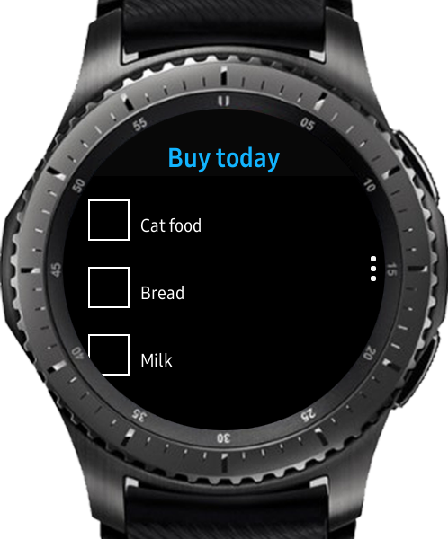
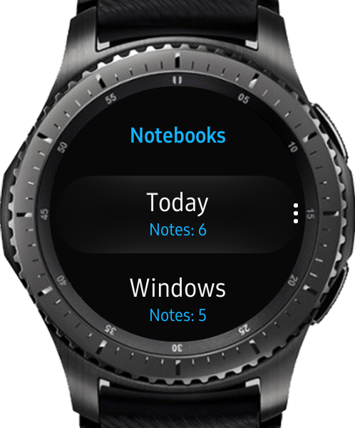
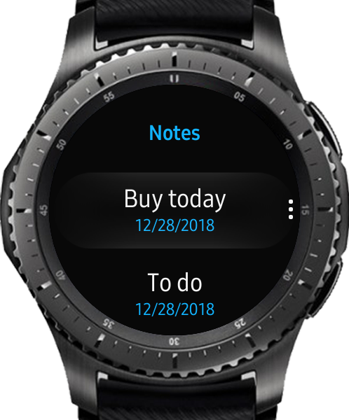
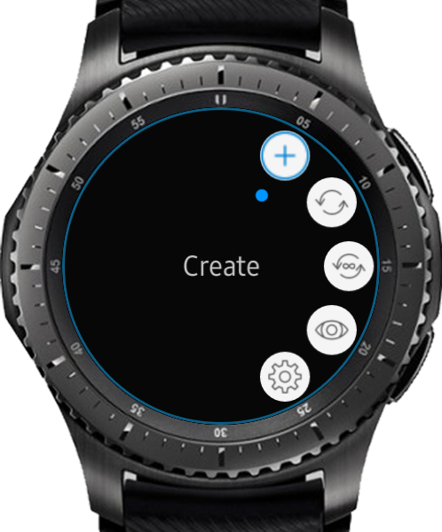
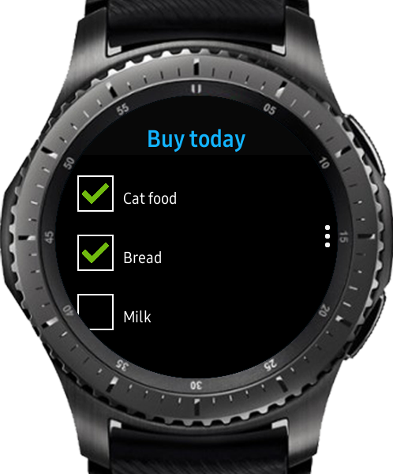
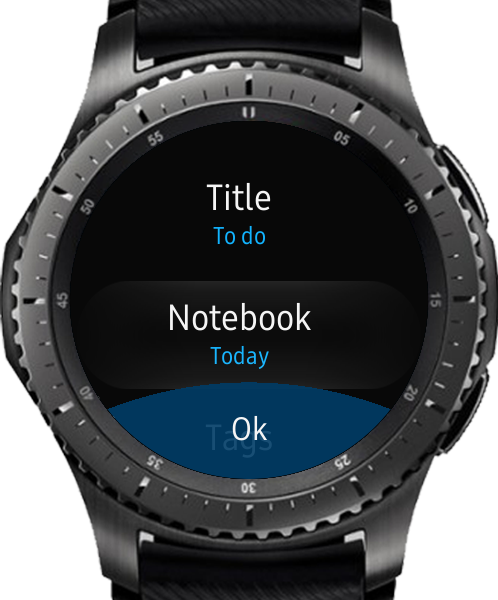
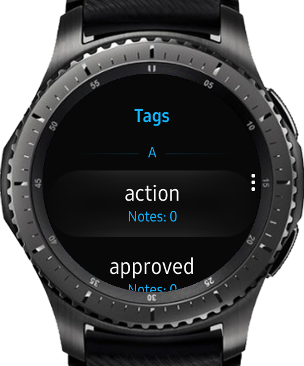
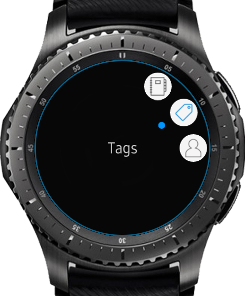
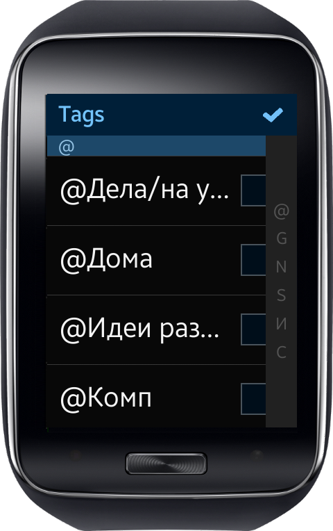
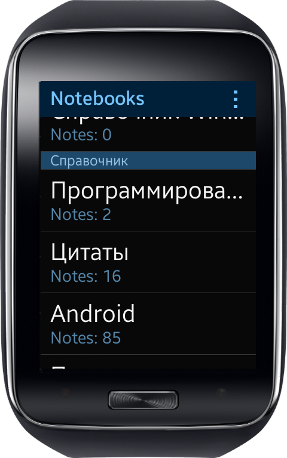
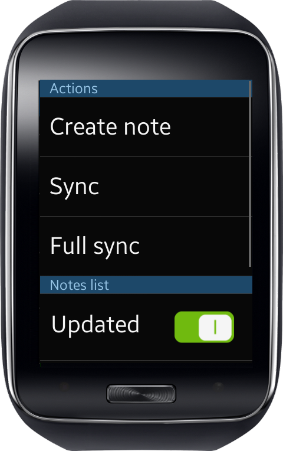
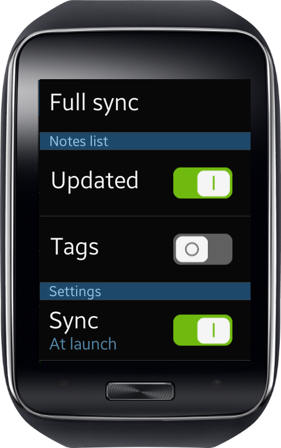
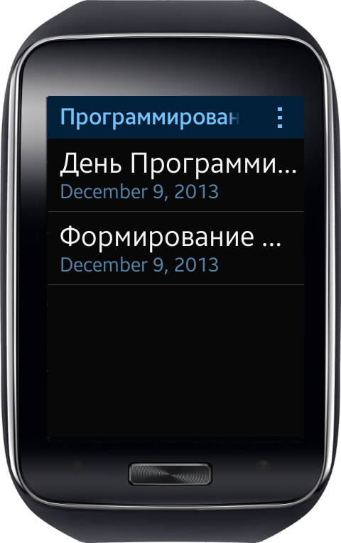
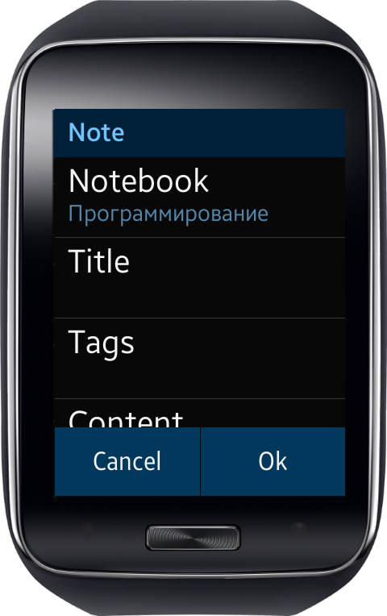

### Features:
Synchronization:
* Full synchronization
* Only last changes
* Option in settings: synchronize at launch
* Changes made on Gear are sent to cloud immidiatelly and reflects on watches until server reply

Notebooks
* Notebooks are grouped by stacks
* Notes count is shown on notebooks list

Tags list
* Tags are grouped by first letter with index bar
* Notes count is shown in tags list

Notes list
* Notes can be found inside notebooks
* Note last modified and/or tags are shown below note title. It can be changed in settings
* Long tap on note show context menu for note
* Swipe back changes view to notebooks list
* Tap on note shows it's content
* Sorting by update date or title

Note
* Watch formatted note content
* Check and uncheck todos. This will either update note on server.
* Edit tags
* Move to another notebook
* Rename note
* Create simple note

Trash. Notes in trash can be restored or changed

To enable input on Gear 2, please install free TypeGear from store.

[Phone part can be found here](https://github.com/RumataEstorish/GearHub)